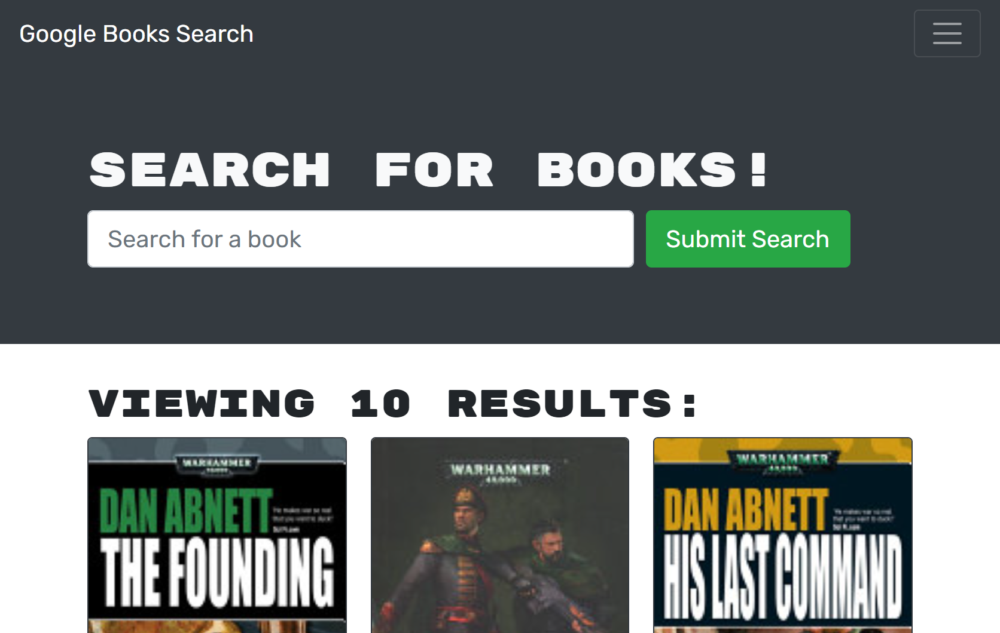

# Book Hunt

 
  ## Description
  Book Hunt is a project that centers around a prebuilt Google API to search for books, with a MERN stack supporting it to create a profile and save or delete books a user is interested in.
  
  ## Table of Contents
  
  * [Installation/Usage](#installation/usage)
  * [Credits](#credits)
  * [License](#license)
  * [Contributions](#contributions)
  * [Tests](#tests)
  * [Questions](#questions)
  
  # Installation/Usage
  [You can see the deployed app here](https://vast-citadel-02849.herokuapp.com/) or if you would rather run it yourself, use "npm run develop"
  
  ## Credits
  This was a solo project, but shoutout to Shane for all his help.

  ## License
  N/A
  
  ## Contributions
  The code is a bit weak in the front end and could benefit from some refactor, but sadly I'm out of time.

  ## Tests
  No tests were set up for this project.

  ## Questions
  * GitHub: xiov91
  * E-Mail: xiovacc@gmail.com
  
  
